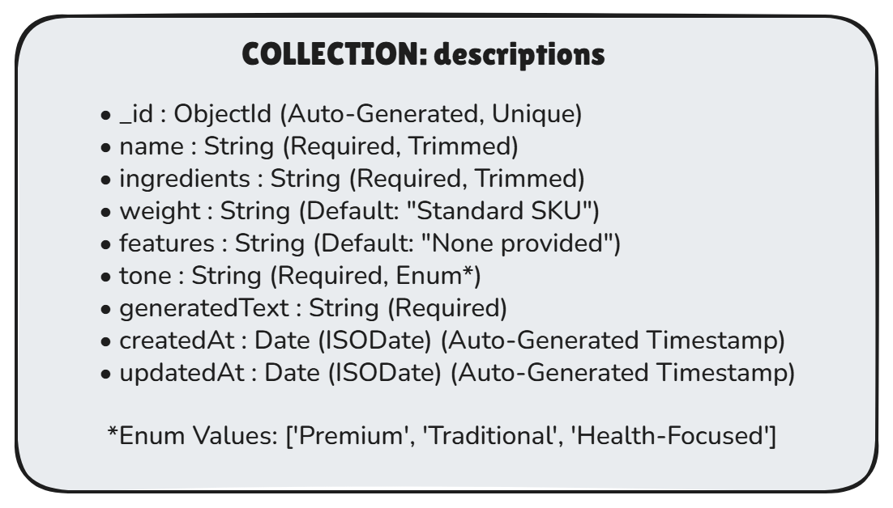

# ShaktiScribe — Smart Descriptor & Variation Engine

A fully responsive, mobile-first web application that utilizes an LLM API framework to instantly transform raw manufacturing specifications into platform-optimized, copy-pasteable marketing descriptions for regional grassroots enterprises.

## 🛠️ Tech Stack
- **Frontend:** React.js
- **Styling:** Tailwind CSS
- **Backend:** Node.js with Express
- **Database:** MongoDB (Atlas)
- **Authentication:** JSON Web Tokens (JWT)
- **Deployment:** Vercel (Frontend) & Render (Backend)


---

## 📂 System Architecture & Project Structure

```text
himshakti-marketing-hub-project/
├── backend/
│   ├── .env.example
│   ├── package.json
│   ├── server.js
│   └── node_modules/
├── frontend/
│   ├── src/
│   │   ├── components/
│   │   │   ├── ui/           # Reusable component design system library
│   │   │   │   ├── index.js
│   │   │   │   ├── Button.jsx
│   │   │   │   ├── Input.jsx
│   │   │   │   ├── Loader.jsx
│   │   │   │   ├── Toast.jsx
│   │   │   │   └── Modal.jsx         
│   │   │   ├── Hero.jsx
│   │   │   ├── Card.jsx
│   │   │   ├── Footer.jsx
│   │   │   └── Navbar.jsx
│   │   └── pages/
│   │       ├── Home.jsx
│   │       ├── Dashboard.jsx # Dynamic input form & live generation flow
│   │       ├── History.jsx 
│   │       ├── Login.jsx   # Live streamed ledger records from server
│   │       └── About.jsx
│   ├── package.json
│   └── vite.config.js
└── README.md                 # Global Workspace Manual Documentation
```

---

# 🛠️ How to Run the System Locally

To test the end-to-end full-stack data workflow loop, you must spin up both the backend and frontend application servers simultaneously.

## ⚙️ Part 1: Setting Up the Backend Engine

Open your terminal window and navigate into the backend folder directory:

```bash
cd backend
```

Install the production and development dependencies matching package configurations:

```bash
npm install
```

Initialize your environment configuration variables. Create a local `.env` file based on the provided blueprint:

```bash
cp .env.example .env
```

Boot up the local REST API development server with live reload tracking enabled:

```bash
npm run dev
```

The server engine will initialize and log:

```text
[ShaktiScribe Server Operational Engine] -> Running live on port 5000.
```

---

## 🎨 Part 2: Setting Up the Frontend Portal

Open a second, separate terminal window or tab and step into the frontend workspace folder:

```bash
cd frontend
```

Install the component library dependencies and Tailwind token styling assets:

```bash
npm install
```

Start up the local Vite development web server pipeline:

```bash
npm run dev
```

The builder will compile your components and serve the web interface locally on:

```text
http://localhost:5173
```

---

# 🎛️ REST API Specification (Week 4 CRUD Matrix)

The Node Express application exposes 6 dedicated data model endpoints whitelisted for cross-origin tracking (CORS) with the local React ecosystem:

| HTTP Method | API Route Endpoint            | Context Function Description                                        | Expected Status Codes          |
| ----------- | ----------------------------- | ------------------------------------------------------------------- | ------------------------------ |
| GET         | `/api/descriptions`           | Streams full ledger array of saved marketing listings               | 200 OK                         |
| GET         | `/api/descriptions/:id`       | Fetches a single distinct description entry card by its explicit ID | 200 OK / 404 Not Found         |
| POST        | `/api/descriptions`           | Parses spec payloads, appends fresh listing items to server cache   | 201 Created / 400 Bad Request  |
| PUT         | `/api/descriptions/:id`       | Modifies existing configuration metrics matching parameter ID keys  | 200 OK / 404 Not Found         |
| DELETE      | `/api/descriptions/:id`       | Completely wipes an entry card block from the backend data array    | 204 No Content / 404 Not Found |
| GET         | `/api/descriptions/search?q=` | Case-insensitively filters list arrays by matching text parameters  | 200 OK                         |

---
## 🗄️ Database Integration & Schema Architecture 

### 📌 Database Choice: MongoDB Atlas (NoSQL Document Store)

For the **ShaktiScribe** application ecosystem, we selected **MongoDB NoSQL** integrated via the **Mongoose ODM (Object Data Modeling)** framework. This architectural decision was made because:

- **Schema Flexibility:** Product copy requirements for varied grassroots MSME sectors (like the *HimShakti Food Processing Unit*) contain highly dynamic parameters, variable layout options, and structural tags that naturally favor NoSQL's flexible, JSON-like document syntax over rigid SQL tables.
- **Rapid Scale Adaptability:** As the underlying generative context models expand, fields can be appended immediately to collection documents without introducing structural migration disruptions or runtime pipeline locks.

---

## 📊 Schema Configuration Blueprint Diagram

The backend enforces a strict modeling validation loop through a single centralized data collection instance tracking the following payload entities:


---

## ⚙️ Setting Up the Cloud Database Base Connection

Provision a shared cluster instance sandbox using the **MongoDB Atlas Cloud Free M0 Tier**. Whitelist a sandbox network firewall mask rule (`0.0.0.0/0`) under cluster configuration.

Formulate an administrative alphanumeric password pair, construct a secure access path connection string, and drop it locally inside your secret environment configuration layout:

```env
MONGO_URI=mongodb+srv://shakti_admin:<password>@cluster0.xxxx.mongodb.net/shaktiscribe?retryWrites=true&w=majority
```

Boot up the local Node.js application process environment terminal loop (`npm run dev`) to bind active connections straight to the operational database.
